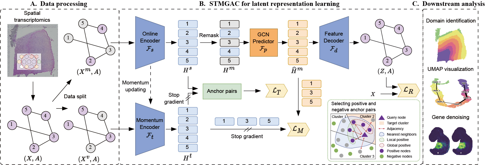

# Masked Graph Autoencoders with Contrastive Augmentation for Spatially Resolved Transcriptomics Data
## Introduction
In this paper, we propose a **Contrastively Augmented Masked Graph Autoencoder (STMGAC)** to learning low-dimensional latent representations for SRT data analysis. First, we use a **masked graph autoencoder** to reconstruct raw gene expression and perform gene denoising. Next, we obtain persistent and reliable **latent space supervision** information through self-distillation, which guides the latent representation for self-supervised matching and results in more stable low-dimensional embeddings. Additionally, we use a plug-and-play method for **selecting positive and negative anchor pairs** in the latent space, leveraging triplet learning to reduce the distance between embeddings of similar items while ensuring better separation of items from different categories, which improves spatial domain clustering. To validate the effectiveness of STMGAC, we compared it with seven advanced methods across five SRT datasets from three different platforms and conducted extensive ablation studies to investigate the contributions of various components. Experimental results show that STMGAC outperforms other state-of-the-art methods in spatial clustering and trajectory inference.

## Installations
- NVIDIA GPU (a single Nvidia GeForce RTX 3090)
-   `pip install -r requiremnts.txt`
- All public datasets used in this paper are available at [Zenodo](https://zenodo.org/records/13253801)

## Get Started
We provided codes for reproducing the experiments of the paper "Masked Graph Autoencoders with Contrastive Augmentation for Spatially Resolved Transcriptomics Data", and comprehensive tutorials for using STMGAC.
- Please see `Tutorial`.

